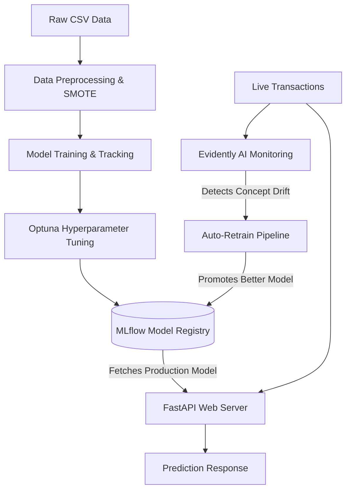
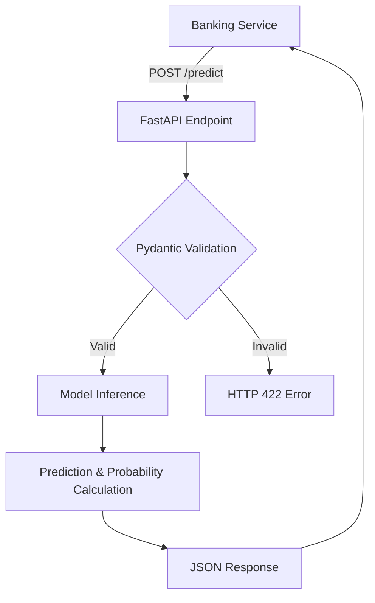
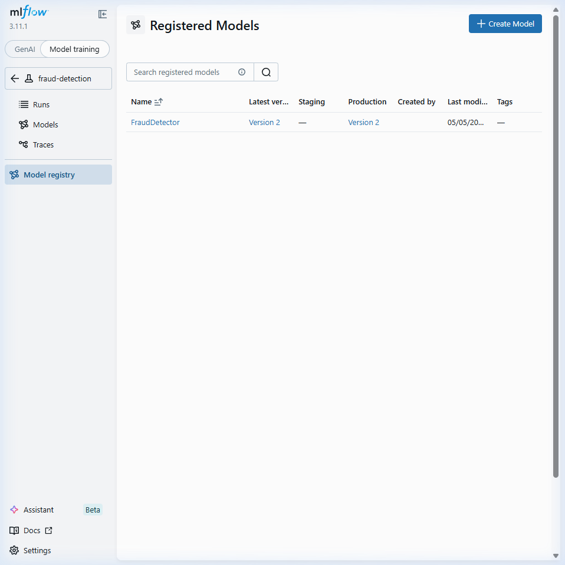
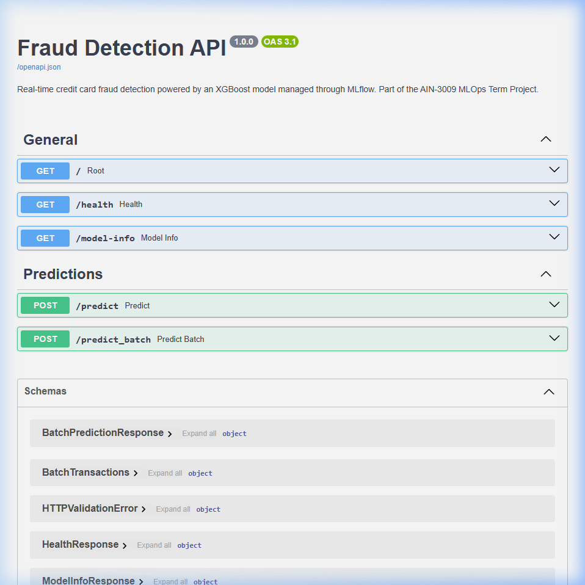

# Credit Card Fraud Detection Pipeline

## Project Information

* **Project Name:** Credit Card Fraud Detection - MLOps Lifecycle
* **Project Type:** AI Project / MLOps System / Backend API
* **Project Description:** An end-to-end, self-healing Machine Learning Operations (MLOps) pipeline designed to detect fraudulent credit card transactions. The system encompasses automated data preprocessing, experiment tracking, hyperparameter tuning, model governance, dynamic REST API deployment, and continuous performance monitoring with automated retraining capabilities.
* **Problem Statement:** Credit card fraud causes massive global financial losses. Detecting it is inherently difficult due to extreme class imbalance (typically <0.2% fraud). Furthermore, traditional static models degrade over time as fraudsters constantly evolve their tactics (Concept Drift), leading to increased false positives and missed fraud.
* **Project Objectives:** Implement a complete ML lifecycle that automatically handles class imbalance, rigorously tracks experiments to ensure reproducibility, deploys models seamlessly with zero downtime, and monitors real-time traffic to automatically heal (retrain) itself when data drift occurs.
* **Target Users:** Data Scientists, Machine Learning Engineers, and Financial Security Analysts.

---

## Technical Stack

### Backend / API

* **Runtime environment:** Python 3.10+
* **Framework:** FastAPI
* **API architecture:** REST
* **Web Server:** Uvicorn
* **Validation:** Pydantic
* **Routing:** FastAPI native routing
* **Error handling:** Custom HTTPExceptions

### Database

* **Database engine:** SQLite (MLflow Backend Store)
* **Data models:** MLflow Experiment & Run schemas
* **Purpose:** Storing hyperparameter configurations, evaluation metrics, and run artifacts.

### AI / Machine Learning

* **Model architecture:** Ensemble & Boosted Trees (XGBoost, Random Forest, LightGBM, CatBoost), Logistic Regression, and MLP Neural Networks.
* **Dataset information:** Kaggle Credit Card Fraud Detection Dataset (284,807 transactions, 30 features).
* **Data preprocessing:** StandardScaler (for Time/Amount), SMOTE (Synthetic Minority Over-sampling Technique) for severe class imbalance.
* **Training process:** Automated training of 6 baseline models followed by 50 trials of Bayesian Optimization using Optuna.
* **Evaluation metrics:** F1-Score, Matthews Correlation Coefficient (MCC), PR-AUC, ROC-AUC, Brier Score, Precision, and Recall.
* **Inference pipeline:** Dynamic loading of the active "Production" model from the MLflow Registry into the FastAPI server.

### Infrastructure & DevOps

* **Experiment Tracking:** MLflow
* **Model Registry:** MLflow Model Registry
* **Performance Monitoring:** Evidently AI
* **Containerization:** Docker & Docker Compose
* **Hardware Acceleration:** CUDA (RTX 3060) configured for XGBoost/CatBoost

---

## Repository Structure

The repository enforces a strict separation of concerns, dividing the ML lifecycle into independent, modular stages orchestrated by a central runner.

```text
Project Structure
├── configs
│   └── config.yaml             # Centralized pipeline hyperparameters and settings
├── data
│   ├── processed               # Generated train/val/test splits (SMOTE applied)
│   └── raw                     # Original creditcard.csv dataset
├── docker
│   ├── docker-compose.yml      # Container orchestration
│   └── Dockerfile              # Application container definition
├── docs                        # Project reports and presentation assets
│   └── screenshots/            
├── notebooks
│   └── 01_eda.ipynb            # Exploratory Data Analysis
├── src
│   ├── __init__.py
│   ├── auto_retrain.py         # Automated drift-triggered retraining logic
│   ├── data_preprocessing.py   # Data loading, scaling, splitting, and SMOTE
│   ├── evaluate.py             # Metric computation and artifact plotting
│   ├── feature_engineering.py  # Feature creation logic
│   ├── monitor.py              # Evidently AI data drift monitoring simulation
│   ├── register_model.py       # MLflow stage transitions (Staging -> Production)
│   ├── serve.py                # FastAPI inference server
│   ├── train.py                # Baseline training and tracking
│   └── tune.py                 # Optuna hyperparameter optimization
├── tests
│   ├── test_api_demo.py        # API endpoint testing
│   └── test_pipeline.py        # Pipeline smoke tests
├── README.md                   
├── requirements.txt            # Python dependencies
└── run_pipeline.py             # Central orchestrator CLI
```

---

## Project Overview

The **Credit Card Fraud Detection MLOps Pipeline** is an enterprise-grade solution designed to address the complexities of deploying and maintaining financial risk models. 

Instead of relying on a static Jupyter Notebook, this project utilizes a modular architecture to handle the entire ML lifecycle. It begins by aggressively combating the 0.17% fraud class imbalance using synthetic data generation (SMOTE). It then tracks the training of six disparate algorithms using MLflow, utilizing Optuna to find the mathematically optimal hyperparameters for the winning XGBoost model. 

The primary value proposition of this system is its **Self-Healing Deployment**: The live FastAPI endpoint dynamically fetches the model from the MLflow registry, enabling zero-downtime updates. When the integrated Evidently AI monitoring system detects concept drift in live transaction streams, it automatically triggers a retraining pipeline, compares the new model against the degraded production model, and promotes the fix seamlessly.

---

## Features

* **⚙️ Automated Pipeline Orchestration:** A central `run_pipeline.py` script to execute the entire lifecycle or individual stages (preprocess, train, tune, serve, monitor).
* **⚖️ Robust Class Balancing:** Integrated SMOTE generation to solve the 99.8% Legitimate / 0.2% Fraud imbalance.
* **📊 Comprehensive Experiment Tracking:** Deep MLflow integration logging all parameters, strict financial metrics (PR-AUC, Brier Score), hardware utilization, and visual artifacts (Confusion Matrices).
* **🧠 Advanced Hyperparameter Tuning:** Automated Bayesian optimization over 50 trials via Optuna for the XGBoost classifier, logged as nested MLflow runs.
* **🚀 Dynamic API Deployment:** A FastAPI server that acts as a "drive-thru window", bypassing hardcoded model files to directly pull the current `Production` model from the MLflow Registry.
* **📉 Continuous Drift Monitoring:** Scheduled simulation of incoming traffic batches, evaluated against reference data using Evidently AI to calculate Data Drift.
* **🔄 Self-Healing Auto-Retraining:** A standalone script that reads drift alarms, retrains a fresh model, evaluates it against the active production model, and automatically promotes it if performance improves.

---

## System Architecture

The architecture decouples the training environment from the serving environment, using MLflow as the central source of truth for model binaries and metadata.



---

## Complete System Workflow

### User Workflow

1. User (or upstream banking service) sends a transaction payload to the API.
2. FastAPI validates the 30 numerical features using Pydantic.
3. The API passes the transaction to the globally loaded XGBoost Production model.
4. The model computes the prediction and fraud probability.
5. The API formats a JSON response containing the prediction, probability, and human-readable label.
6. The client system acts on the prediction (e.g., blocking the transaction).



---

## Technical Workflow

### Training & Tuning Workflow

* **Initialization:** `run_pipeline.py` triggers `data_preprocessing.py`.
* **Preprocessing:** Loads YAML config, scales `Amount` and `Time`, splits data, applies SMOTE to the training set, and saves to `data/processed/`.
* **Experiment Tracking:** `train.py` iterates over 6 architectures. Fits models, generates predictions, calculates metrics, plots curves, infers MLflow signatures, and registers artifacts.
* **Tuning:** `tune.py` initializes an Optuna study. Executes 50 nested MLflow runs. The best parameter combination is extracted, retrained on the full dataset, and pushed to the MLflow Registry.

### Deployment Workflow

* **Initialization:** `serve.py` starts Uvicorn.
* **Model Loading:** During startup, `mlflow.pyfunc.load_model("models:/FraudDetector/Production")` fetches the active model binary.
* **Request Handling:** The `/predict` endpoint receives a JSON payload, converts it to a Pandas DataFrame matching the MLflow Signature, and executes `.predict()`.

### Monitoring & Healing Workflow

* **Drift Check:** `monitor.py` slices test data into temporal batches. Evidently AI compares the latest batch to the validation reference dataset.
* **Alarm Generation:** If the `share_of_drifted_columns` exceeds the 0.3 threshold, HTML drift reports are logged to MLflow and drift flags are raised.
* **Resolution:** `auto_retrain.py` queries the MLflow API for recent runs tagged with `drift_detected`. It pulls the latest data, trains a new XGBoost model, checks if F1/AUC exceeds current Production, and executes `transition_model_version_stage` if successful.

---

## AI Workflow


---

## API Documentation

### API Architecture

The application utilizes a RESTful architecture powered by FastAPI. 
All requests strictly adhere to the model's expected input signature (30 float features).

### Endpoints Table

| Method | Endpoint | Description | Authentication |
| ------ | -------- | ----------- | -------------- |
| GET | `/` | Root welcome message and endpoint list | None |
| GET | `/health` | Service health and model load status | None |
| GET | `/model-info` | Returns current MLflow model version and stage | None |
| POST | `/predict` | Single transaction fraud prediction | None |
| POST | `/predict_batch` | Batch transaction prediction | None |

#### Request Example (`POST /predict`)

```json
{
  "features": [1.2, -0.5, 3.1, 0.0, -0.9, 1.1] 
}
```
*(Array must contain exactly 30 numerical features)*

#### Response Example

```json
{
  "prediction": 1,
  "probability": 0.893451,
  "label": "Fraud",
  "timestamp": "2026-06-18T12:00:00.000Z"
}
```

---

## Authentication & Security

*Currently, this microservice is designed to operate within an internal, secured virtual private cloud (VPC). API Gateway authentication (e.g., OAuth2/JWT) should be implemented upstream before routing traffic to this inference container.*

---

## Database Documentation

The project utilizes a local SQLite database (`mlflow.db`) strictly to serve as the MLflow Tracking Backend.

* **Entities:** Experiments, Runs, Metrics, Parameters, Tags.
* **Artifacts:** Stored locally in the `mlartifacts/` directory, mapped to database run IDs.

---

## Goals & Technical Achievements

| Goal | Technical Implementation | Achievement |
| ---- | ------------------------ | ----------- |
| **Solve Extreme Imbalance** | Applied SMOTE during training data preparation. | Achieved meaningful recall rates without model collapse into majority class guessing. |
| **Ensure Reproducibility** | Deep MLflow integration logging `config.yaml`, git commits, and parameters. | 100% reproducibility of any historical training run. |
| **Zero-Downtime Updates** | Dynamic MLflow Registry fetching via FastAPI startup. | Decoupled inference code from model binaries. |
| **Mitigate Concept Drift** | Integrated Evidently AI to compare live distributions against reference sets. | Automated HTML drift reports and quantitative drift metrics. |
| **Self-Healing Systems** | Python script querying MLflow API for drift tags to trigger retraining. | Pipeline automatically heals degraded models without human intervention. |

---

## Project Benefits & Impact

### User Benefits

Financial institutions can integrate this API directly into their transaction processing pipelines to block fraudulent charges in milliseconds, dramatically reducing financial loss and improving customer trust.

### Technical Benefits

* **Maintainability:** The modular structure ensures data engineers can update preprocessing logic without affecting the FastAPI deployment code.
* **Reliability:** Automated pipeline tests and MLflow registry staging protect production from unstable model versions.
* **Adaptability:** The auto-retraining loop ensures the system naturally adapts to seasonal spending changes or new fraudster tactics.

### Business Value

By automating the MLOps lifecycle—from tracking to drift mitigation—the system vastly reduces the manual engineering hours required to maintain an ML model in production, lowering total cost of ownership (TCO).

---

## Tools & Technologies

| Category | Technology | Purpose | Reason for Selection |
| -------- | ---------- | ------- | -------------------- |
| **Language** | Python 3.10+ | Core logic | Industry standard for Data Science |
| **Framework** | FastAPI | REST API Server | High performance, async capabilities, auto-docs |
| **ML Models** | XGBoost, Scikit-Learn | Classification | Superior performance on tabular data |
| **Tracking/Registry**| MLflow | Lifecycle Management | Centralized experiment and governance tracking |
| **Tuning** | Optuna | Hyperparameter Optimization | Efficient Bayesian search spaces |
| **Monitoring** | Evidently AI | Concept Drift | Built-in statistical tests for data drift |
| **Serving** | Uvicorn | ASGI Web Server | Production-ready asynchronous server |

---

## Installation Guide

### Requirements

* Python 3.10+
* Git
* Optional: NVIDIA GPU with CUDA for accelerated training.

### Setup Instructions

1. **Clone the repository:**
```bash
git clone https://github.com/msbztio2/fraud-detection-mlops.git
cd fraud-detection-mlops
```

2. **Create and activate a virtual environment:**
```bash
python -m venv venv
# Windows
venv\Scripts\activate
# Linux/Mac
source venv/bin/activate
```

3. **Install dependencies:**
```bash
pip install -r requirements.txt
```

4. **Prepare the Data:**
Download `creditcard.csv` from Kaggle and place it in the `data/raw/` directory.

5. **Run the Full Pipeline (Preprocess, Train, Tune, Monitor):**
```bash
python run_pipeline.py
```

6. **Start the Inference Server:**
```bash
python src/serve.py
```

---

## Environment Variables

| Variable | Description | Required |
| -------- | ----------- | -------- |
| `MLFLOW_TRACKING_URI` | URI for the MLflow tracking server (Defaults to `sqlite:///mlflow.db`) | No |

---

## Testing

The project utilizes `pytest` for smoke testing and pipeline validation.

**Testing Strategy:**
* **Unit Testing:** `test_api_demo.py` ensures FastAPI endpoints conform to expected Pydantic schemas.
* **Integration Testing:** `test_pipeline.py` runs a scaled-down version of the pipeline to ensure data flows correctly between modules.

```bash
pytest tests/
```

---

## Deployment Workflow

In a production scenario, the deployment workflow operates via CI/CD (e.g., GitHub Actions):

1. **Developer** commits changes to hyperparameters in `config.yaml`.
2. **CI/CD** triggers `run_pipeline.py --stage train` and `--stage tune`.
3. The winning model is pushed to the **MLflow Registry**.
4. The **FastAPI Server** is restarted to pull the new model binary.
5. **Evidently AI** begins monitoring live endpoint traffic.


---

## Performance & Scalability

* **Algorithm Optimization:** Utilizing XGBoost with `device: "cuda"` ensures rapid training over the 280k+ rows.
* **API Performance:** FastAPI handles requests asynchronously. Uvicorn can be scaled horizontally using multiple worker processes (`--workers 4`).
* **Future Improvements:** Transitioning the SQLite MLflow backend to a managed PostgreSQL instance and S3 bucket for distributed artifact storage.

---

## Screenshots

### MLflow Experiment Tracking


### Model Registry Lifecycle


### FastAPI Swagger UI


---

## Troubleshooting

| Problem | Solution |
| ------- | -------- |
| **HTTP 503: Model not loaded** | Ensure `run_pipeline.py` has been executed completely so a model exists in the `Production` stage of the MLflow Registry. |
| **Evidently AI Import Error** | Check `requirements.txt` to ensure Evidently is installed. The system falls back to a basic KS-test if missing. |
| **CUDA Out of Memory** | Reduce `n_estimators` in `config.yaml` or set `device: "cpu"` under XGBoost parameters. |

---

## Future Improvements

| Feature | Description | Priority |
| ------- | ----------- | -------- |
| **Cloud Object Storage** | Migrate MLflow artifacts from local disk to AWS S3/GCS. | High |
| **Model Explainability** | Integrate SHAP to explain feature contributions per prediction via the API. | Medium |
| **Kafka Integration** | Transition monitoring from batch scripts to real-time Apache Kafka streaming. | Low |

---

## Contributors

* **Lead ML Engineer:** MOURAD SLEEM 

---

## License

This project is open-source and available under the [MIT License](LICENSE).
