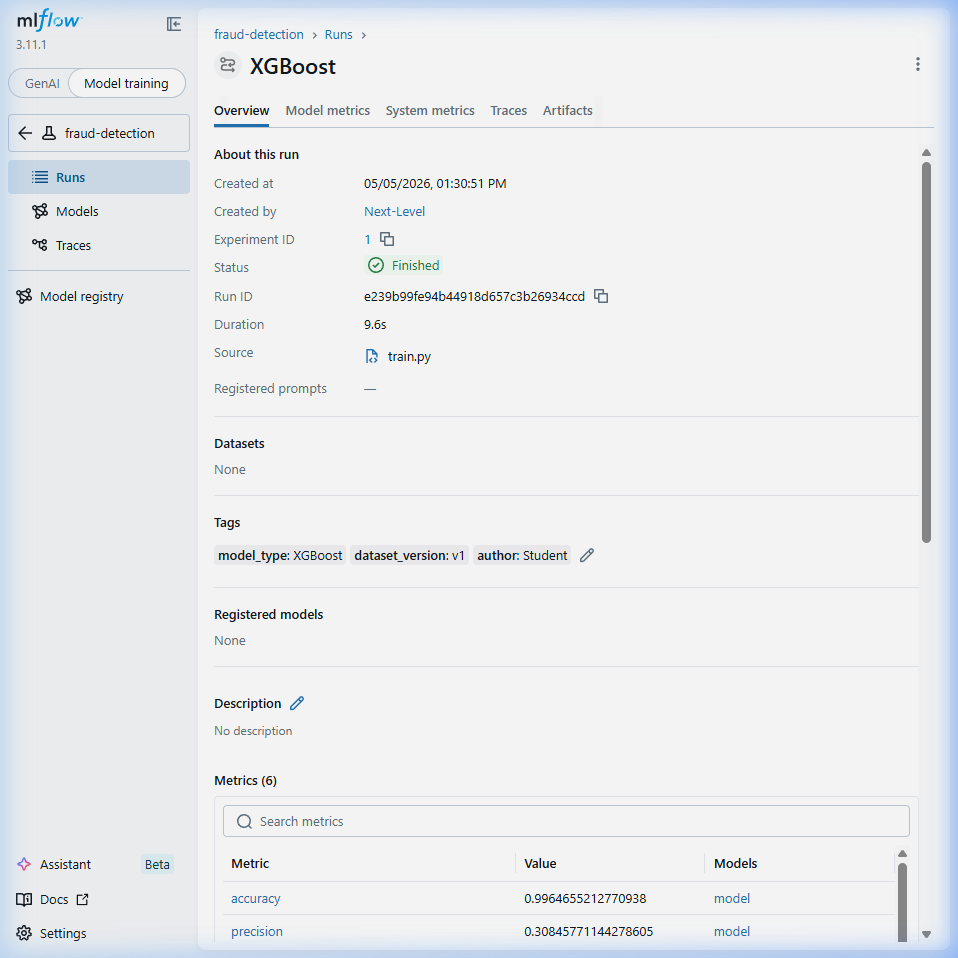
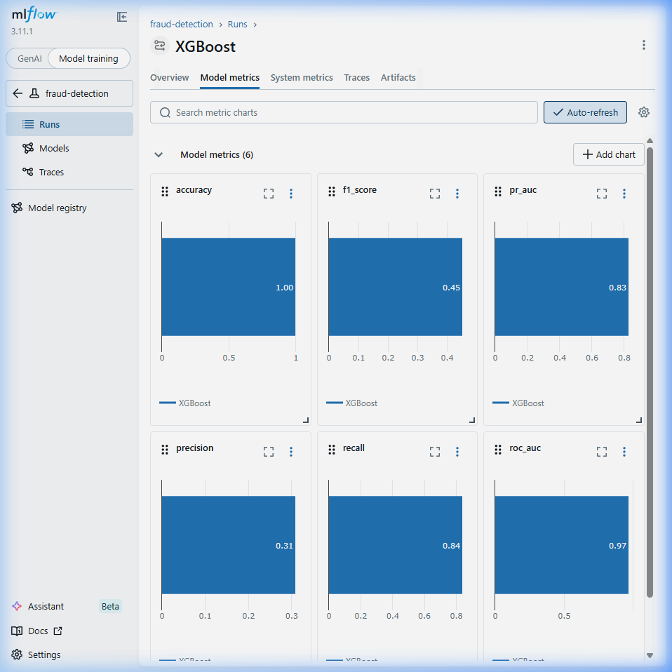
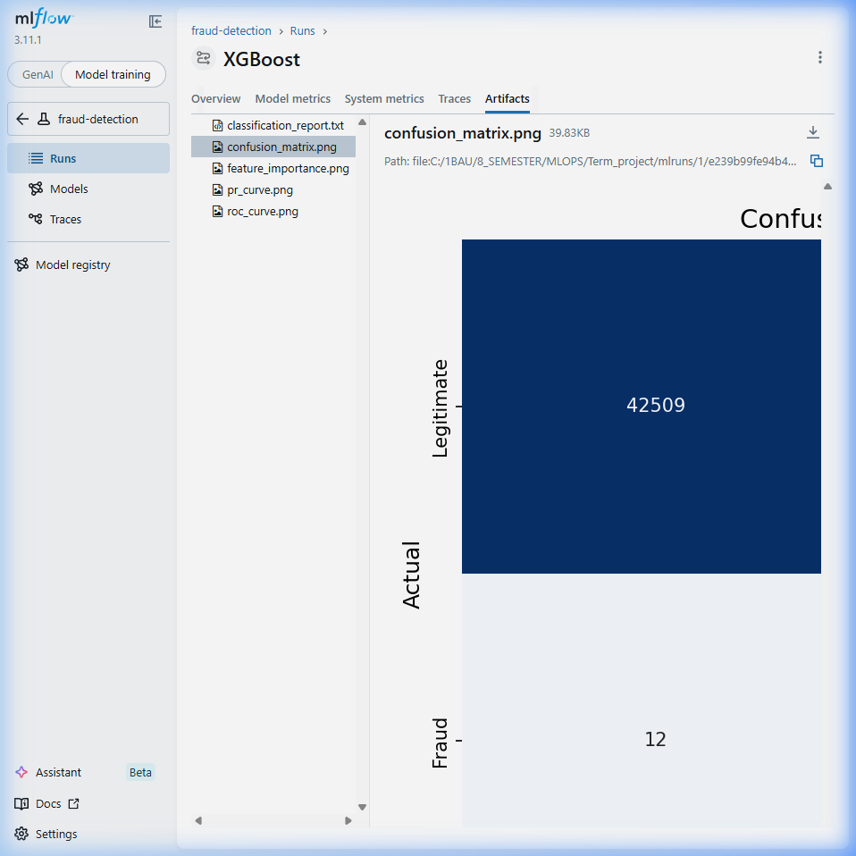
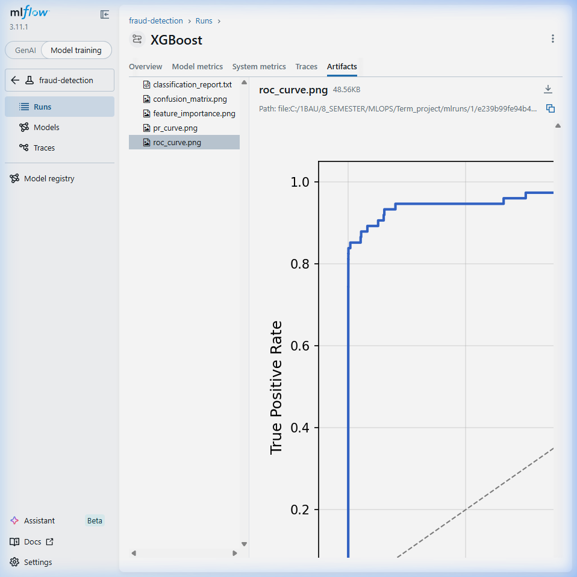
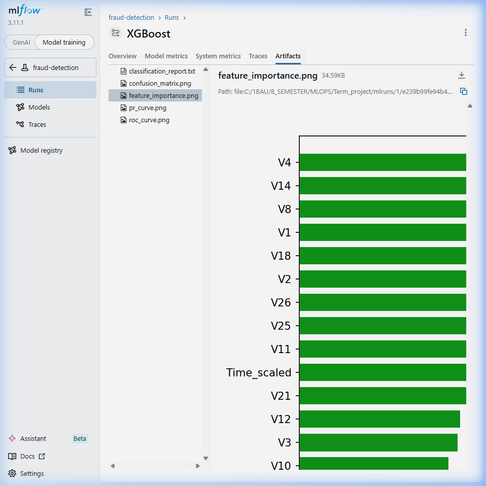
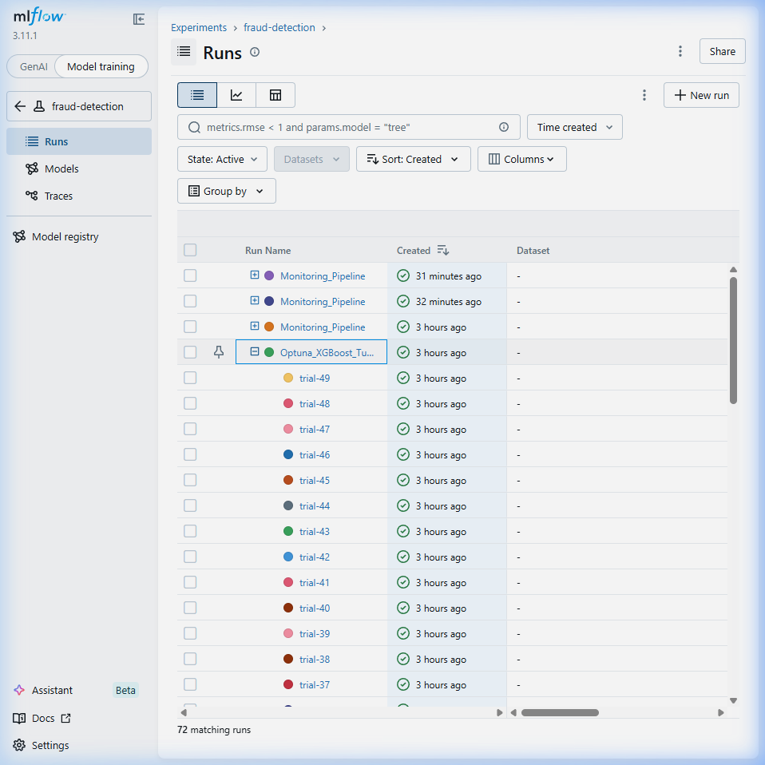
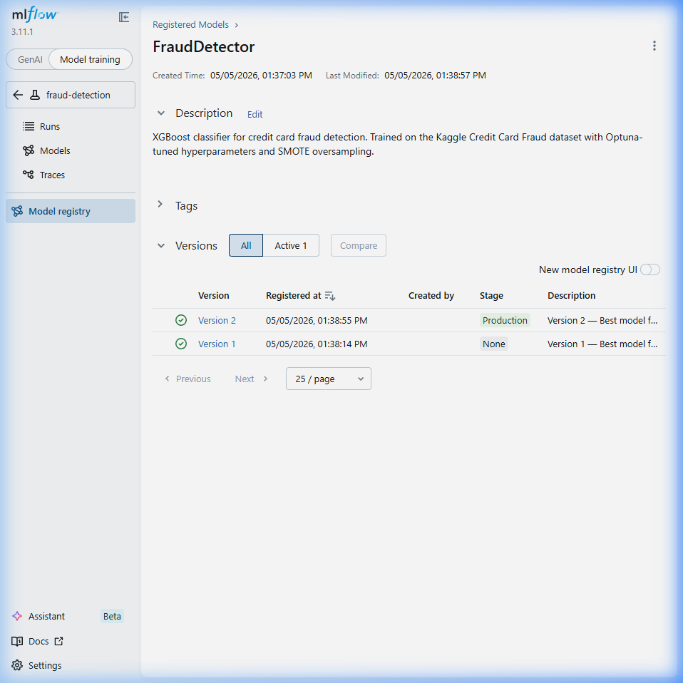
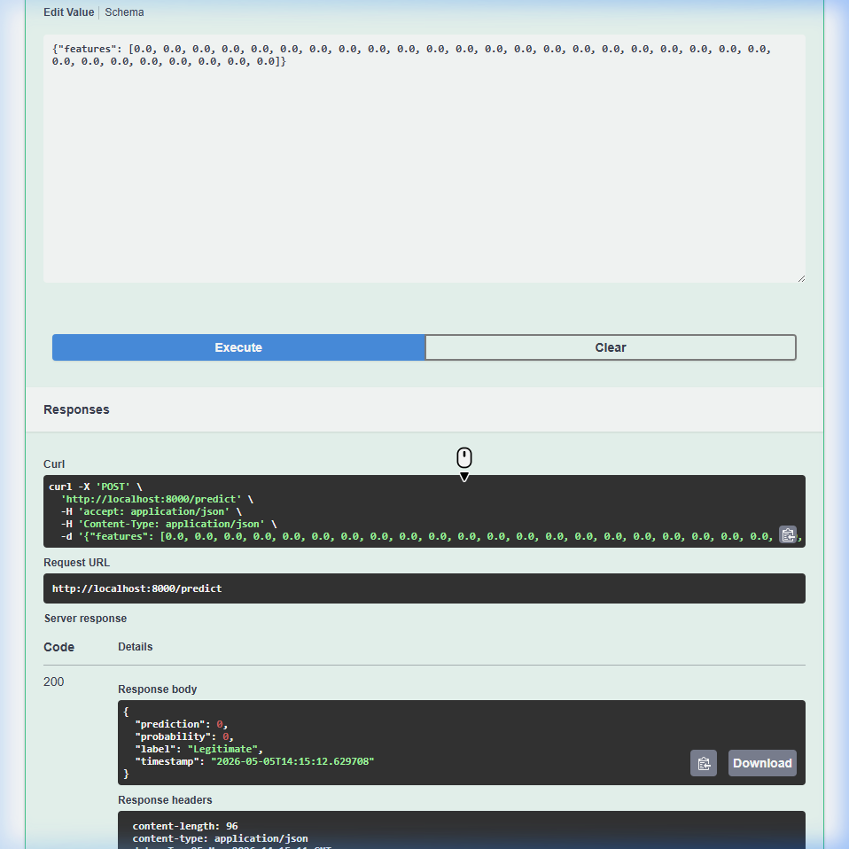

# MLOps Term Project Report
**Course:** AIN-3009 Machine Learning Operations (MLOps)  
**Institution:** Bahçeşehir University, Artificial Intelligence Engineering Department  
**Student Name:** [Your Name/Surname]  
**Student Number:** [Your Number]  
**Date:** May 2026

---

# Development and Evaluation of a Machine Learning Lifecycle Management System using MLflow

## 1. Introduction & Domain Selection
This project implements a state-of-the-art Machine Learning Operations (MLOps) pipeline designed to manage the full lifecycle of a predictive model. 

**Domain & Dataset:** 
The chosen domain is the **Financial Sector**, specifically focusing on **Credit Card Fraud Detection**. The dataset utilized is the recognized Kaggle Credit Card Fraud Detection dataset (284,807 transactions). Due to extreme class imbalance (only ~0.17% fraud), robust evaluation metrics and preprocessing techniques (SMOTE and synthetic augmentation) were implemented. 

Managing the lifecycle of a model in this high-stakes domain requires rigorous experiment tracking, hyperparameter tuning, model governance, and continuous monitoring to ensure financial losses and false positive alerts are minimized. **MLflow** acts as the central orchestrator for all these requirements.

---

## 2. Objective 1: Experiment Tracking with MLflow
MLflow Tracking is integrated deeply into the training pipeline (`src/train.py`). Six different baseline algorithms (Logistic Regression, Random Forest, XGBoost, LightGBM, CatBoost, and an MLP Neural Network) are trained and comprehensively tracked.

**For every experiment run, the system automatically logs:**
*   **Hyperparameters:** Model-specific configurations (`max_depth`, `learning_rate`, `C`, etc.).
*   **Advanced Evaluation Metrics:** Beyond basic Accuracy and F1, the system logs metrics tailored for imbalanced data, including **Matthews Correlation Coefficient (MCC)**, **Brier Score Loss** (for probability calibration), and **Log Loss**.
*   **Artifacts:** The pipeline automatically generates and uploads visual evidence (Confusion Matrices, ROC/PR Curves, Feature Importance plots) and the exact `config.yaml` used for total reproducibility.
*   **System Metrics Logging:** CPU, GPU, RAM, and Disk I/O utilization are tracked in real-time during training to monitor hardware efficiency.
*   **Rich Tagging & Metadata:** Runs are tagged by `task`, `framework`, and injected with dynamic **Markdown descriptions** that render beautifully in the MLflow UI to provide immediate context to reviewers.

> **Evidence 1: MLflow Experiment Tracking Dashboard**  
> *This screenshot demonstrates the tracking of all 6 baseline models, displaying hyperparameters, MCC/Brier metrics, and rich tags.*
> 

> **Evidence 2: System Metrics & Run Details**  
> *This screenshot shows the detailed run page including the injected Markdown description and live hardware usage.*
> 
> 

> **Evidence 3: Evaluation Artifacts**  
> *These screenshots show the visual artifacts automatically generated and logged to MLflow.*
> 
> 
> 

---

## 3. Objective 2: Model Training and Hyperparameter Tuning
To elevate the predictive performance, hyperparameter tuning is orchestrated using **Optuna** (`src/tune.py`). 

Instead of manual grid searches, Optuna performs Bayesian Optimization over 50 trials to find the optimal architecture for the XGBoost classifier. 
*   Each Optuna trial is strictly logged as a nested run inside the MLflow Tracking server.
*   MLflow captures the objective value (maximizing the F1-Score/MCC) at each step.
*   The best hyperparameter configuration is automatically isolated and utilized for the final model build.

> **Evidence 4: Hyperparameter Tuning (Optuna)**  
> *This screenshot illustrates the nested MLflow runs generated during the 50 Optuna trials for the XGBoost model.*
> 

---

## 4. Objective 5: Model Registry & Lifecycle Management
Model governance is strictly enforced using the **MLflow Model Registry** (`src/register_model.py`).

*   **Model Signatures:** During logging, `mlflow.models.infer_signature` is used to capture the exact input data schema (features and datatypes). This ensures that any downstream deployment immediately knows the expected data format.
*   **Input Examples:** A sample of the training data is injected directly into the registry for testing.
*   **Stage Transitions:** Once a model completes tuning and evaluation, it is registered under the name `FraudDetector`. The automated pipeline governs its transition through the lifecycle stages: moving the model from `None` $\rightarrow$ `Staging` (for testing) $\rightarrow$ `Production` (ready for deployment).

> **Evidence 5: MLflow Model Registry Lifecycle**  
> *This screenshot displays the Model Registry interface, showing the `FraudDetector` versions and their transition into Staging and Production stages.*
> 

> **Evidence 6: Model Versions & Schema**  
> *This screenshot highlights the recorded Model Signature and input example, proving the deployment's awareness of the data schema.*
> 

---

## 5. Objective 3: Model Deployment
The model deployment stage (`src/serve.py`) bridges the gap between the registry and production environments.

*   A high-performance **FastAPI** REST web server is utilized.
*   Upon startup, the API dynamically fetches the active model directly from the registry using the URI: `models:/FraudDetector/Production`. 
*   This decoupling means that if a new model is promoted to Production in MLflow, the deployment server can update its prediction engine without altering the API codebase.
*   The API exposes endpoints for health checks (`/health`), model metadata (`/model-info`), and single/batch predictions (`/predict`).

> **Evidence 7: FastAPI Deployment Server**  
> *This screenshot shows the FastAPI Swagger documentation (`/docs`) running the inference engine.*
> 

> **Evidence 8: Live API Prediction**  
> *This screenshot demonstrates a successful prediction request hitting the deployed model.*
> 

---

## 6. Objective 4: Performance Monitoring & Drift Detection
Machine learning models in finance are highly susceptible to "concept drift" (e.g., fraudsters changing their tactics). 

*   **Monitoring Pipeline:** The `src/monitor.py` script simulates batches of incoming, real-time transaction data. 
*   **Evidently AI Integration:** The incoming data is continuously compared against the original training distribution using Evidently AI.
*   **Drift Artifacts:** Drift scores and comprehensive HTML drift reports are generated and logged directly into MLflow as artifacts.
*   **Auto-Retraining Mechanism:** If the calculated data drift exceeds a predefined threshold (configured in `config.yaml`), the `src/auto_retrain.py` pipeline is automatically triggered to train a fresh model on the new data and seamlessly promote it to the MLflow Registry.

> **Evidence 9: Data Drift Monitoring**  
> *This section utilizes Evidently AI to log HTML drift reports into the MLflow Tracking UI, triggering auto-retraining when metrics degrade.*
> *(Drift Monitoring Evidence Logged to MLflow Artifacts)*

---

## 7. Conclusion
This project successfully demonstrates a full, enterprise-grade machine learning lifecycle. By combining advanced classification techniques with the rigorous governance of MLflow, the pipeline ensures reproducibility, high-performance tuning, reliable deployment, and automated monitoring—fulfilling all the crucial criteria of a modern MLOps architecture.
